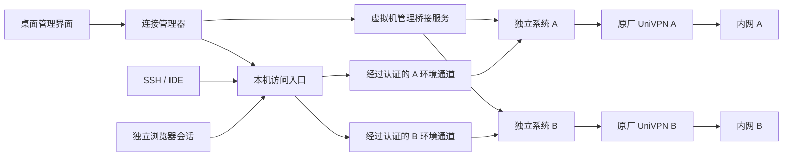

# Windows / macOS 多 VPN 管理应用设计

状态：公开开发中的设计，原厂兼容性待实测。日期：2026-10-08（北京时间）。项目：MultiVPN。

## 1. 设计结论

设计一个同时面向 Windows 和 macOS 的多 VPN 应用：共享桌面界面、连接模型和访问层，各平台适配独立运行环境。对于 UniVPN，优先验证“每条 VPN 一个独立操作系统环境”，由桌面应用管理环境、连接状态和访问入口。

这条路线复用原厂拨号客户端，让每条连接拥有独立的进程、监听端口、路由和 DNS。开发前仍需证明原厂客户端能够在虚拟机中完成认证、访问内网，并且宿主机与虚拟机之间的访问通道在 VPN 连接后仍然可用。

暂按 SSH 和浏览器访问多个内网设计首版。全系统透明访问列为独立阶段，不能由首版代理可用推导为已经支持。

公开仓库为 [MultiVPN](https://github.com/Kirrito-k423/MultiVPN)。已实现无平台依赖的连接生命周期核心及其模型测试，并增加 [Linux 隔离诊断 PoC](../../poc/linux/README.md)；生产平台后端、桌面界面、完整访问代理、真实双连接与性能结果尚缺。模型和诊断控制测试不代表真实 VPN 兼容性。

## 2. 已核实的事实与判断边界

| 编号 | 事实 | 来源 | 能证明什么 |
|---|---|---|---|
| F1 | 初次匿名调查环境为 macOS 15.7.4、arm64、16 GiB 内存 | `sw_vers`、`uname -m`、`sysctl -n hw.memsize` | 只有 Mac 安装观察，不能推导 Windows 行为 |
| F2 | UniVPN 安装在 `/Applications/UniVPN.app`，版本为 `10781.18.0.0116`，bundle ID 为 `work.VPNClient` | `Contents/Info.plist` | 固定本次调查的安装版本 |
| F3 | 安装包包含 Qt 图形客户端、UniVPNPromoteService 和 UniVPNCS；主程序与 UniVPNCS 均为 x86_64 Mach-O，后者具有 setuid 标记 | 文件清单、`file` | 存在多个运行组件；需要验证虚拟机中的执行与提权兼容性 |
| F4 | 主程序字符串包含 `SingleApplication`，动态符号引用 `QLocalServer` | `strings`、`nm -C` 的定向匹配 | 是单实例机制的静态线索，未确定锁名、检查流程或全部限制 |
| F5 | 本次运行中后台组件监听 `127.0.0.1:29191`，UniVPNCS 还监听 `127.0.0.1:19060` | `lsof` | 同时启动第二套后端可能存在端口冲突；尚未证明端口是否可配置 |
| F6 | 随附指南提醒在同一终端同时使用多个 VPN 拨号软件可能导致异常 | 本机 `UniVPN_zh.pdf`，PDF 第 10 页 | 原厂指南没有为同系统多拨号提供兼容性保证 |
| F7 | 指南描述 Linux CLI：通过 UniVPNCS 启动，CLI 与 GUI 不能同时运行；CLI 的 SSL VPN 认证仅支持用户名/密码，关闭终端会断开 | 同一 PDF，第 70–71 页 | Linux CLI 可作为条件性适配方向，不能假设支持证书、扫码或任意 MFA |
| F8 | 设计需要与用户已有互联网代理共存 | 使用场景与进程类别观察 | 需要单独验证各平台代理配置与 TUN 模式 |

**推断：**仅复制 `.app`、修改名称或重新打开窗口，不能可靠地隔离后台、路由和 DNS。即使绕过图形界面的单实例检查，第二套连接仍需解决这些共享资源。

**未知：**实际使用的 VPN 类型、网关版本、认证方式、内网网段、服务器会话限制和虚拟机准入策略。没有读取账户配置、密码、证书或连接日志，也没有测试第二次拨号。

UniVPN 官方介绍同时列出 SSL VPN、L2TP、L2TP over IPSec。当前连接协议不能从应用名称推断。“SSL VPN”也不能证明兼容 OpenVPN、WireGuard 或 OpenConnect。参见[原厂产品介绍](https://leagsoft.com/new-detail/1088)。

## 3. 需求与验收

| ID | 需求 | 首版范围 | 验收方式 |
|---|---|---|---|
| R1 | 至少两条 VPN 能同时保持连接 | 必须；先验证两条，不承诺无限并发 | 同时访问两个内网的已知测试目标，确认各自身份和出口 |
| R2 | 可独立连接、断开和重新认证 | 必须 | 断开 A 后 B 的新请求仍成功；不承诺故障时现有 TCP 会话无损 |
| R3 | 两个内网可使用相同 IP 或域名 | 显式选择连接的入口必须支持 | 在 A、B 分别访问相同地址，得到两个不同的已知服务标识 |
| R4 | 支持 SSH 与浏览器访问 | 首版覆盖 TCP、HTTP/HTTPS | SSH 主机密钥核验正确；浏览器通过所选连接访问目标 |
| R5 | DNS 与连接归属一致 | 必须 | 将原始域名交给对应环境解析；内网域名不发往公共 DNS |
| R6 | VPN 断开后已选内网请求拒绝转发 | 必须 | 验证没有自动走公网、其他 VPN 或其他代理的回退路径 |
| R7 | 与本机互联网代理共同使用 | 验证目标，不是已确认结果 | 普通互联网请求仍按用户已有代理配置处理，内网入口按指定 VPN 处理 |
| R8 | 登录兼容原厂认证 | 必须，但首版允许用户在原厂界面完成登录 | 按实际网关认证流程完成登录；无法支持的流程明确显示 |
| R9 | 全系统应用无需设置代理 | 第二阶段单独验证 | 系统扩展、DNS、流量规则和部署检查全部完成后再声明支持 |
| R10 | Windows 与 macOS 提供一致的连接语义和访问体验 | 必须 | Windows x64、Mac ARM/Intel 核心 CI；每种实际后端分别做真实 VPN 验证 |

首版不承诺 ICMP、任意 UDP、QUIC、容器网络、所有系统服务或任意企业认证自动化。需要这些能力时，应作为新增需求建立独立验收项。

## 4. 候选方案与决定

| 方案 | 优点 | 主要代价或未知 | 决定 |
|---|---|---|---|
| 多开原厂客户端 | 不需要额外操作系统 | Mac 已有单实例/端口线索；Windows 未调查；两者均需原厂并发支持证据 | 暂不作为主路线 |
| 自研 UniVPN 协议客户端 | 有机会做到轻量原生多隧道 | 未取得协议/SDK、多会话支持及网关兼容证据；认证和升级成本大 | 获得原厂接口后重新评估 |
| 每条 VPN 一个 macOS 虚拟机 | 可尝试复用现有 Mac 客户端与认证界面；操作系统级隔离 | 内存、磁盘、启动时间；x86 客户端在 ARM guest 的运行、驱动与认证待测 | 优先做兼容性 PoC |
| Windows 上每条 VPN 一个 Hyper-V 虚拟机 | 独立系统可复用 Windows 原厂客户端；也可选择匹配的 Linux guest | Windows 版本、虚拟化、管理员权限、guest 认证和管理通道待确认 | Windows 优先 PoC 路线 |
| 双平台通过 SSH 接入已配置的独立 guest | 共享访问层，无需应用自动创建虚拟机 | 初次安装人工完成；host/guest 通道、认证与防回退待验证 | 首版共用接入方式 |
| 每条 VPN 一个 Linux 虚拟机 | 有 CLI 适配路径，可能降低资源开销 | 安装包架构、发行版和认证方式必须匹配；不能假设 x86 包可原生运行于 ARM guest | 找到匹配客户端后再评估 |
| Linux 内独立 namespace/container | 理论上可隔离部分网络资源 | 原厂服务、文件路径、驱动、权限及 DNS 写入可能仍共享；Mac 仍需 Linux VM | PoC 证明后再做优化 |

**ADR-1：先用独立系统证明并发连接。**避免把成功打开两个界面当成两条 VPN 都能访问内网。代价是资源占用，重审条件是取得原厂支持的多会话接口，或虚拟机方案无法满足认证、准入或容量要求。

**ADR-2：首版按连接提供访问入口。**相同目标地址在两个内网中属于两个不同目的地，必须额外携带连接身份。代理端口、SSH 主机别名和独立浏览器会话就是这个身份。

**ADR-3：先验证现有客户端，不修改原厂二进制。**当前设计不依赖更改单实例检查、补丁后端端口或替换签名。取得原厂可配置接口后可在适配器层增加支持。

**ADR-4：增加 Linux 容器兼容性实验。**2026-10-08 核对[原厂下载页](https://www.leagsoft.com/doc/article/103197.html)，新增 Linux ARM / Ubuntu 26.04 LTS 包提供了本机匹配架构的实验路径。本机没有独立 macOS guest 且磁盘容量有限，先用现有 Docker Linux 引擎验证原厂 CLI、后台端口、受限 SSH 管理与目标出口，再决定是否能作为支持的环境适配器。

该实验使用独立网络、PID 和文件系统命名空间，不使用 host 网络或全特权容器；管理端口仅映射 loopback。各容器仍共享 Linux VM 内核，不能替代独立 VM 的安全边界。SSH 和 IPv4/TCP 目标守卫只用于诊断，原厂可改写网络规则、DNS/IPv6/UDP、宿主故障和登录准入仍待验证。Windows 使用匹配的 x86_64 原厂包另行实测，本机 ARM 结果不推导为 Windows 成功。

## 5. 架构与运行部署



图中实际网络与虚拟机组件均为拟实现设计；连接管理器已有生命周期模型基础。宿主机的访问入口到 guest 的传输方案必须经过 P0 验证，不能仅凭该图认定可用。

### 5.1 逻辑与开发视图

| 模块 | 职责 | 拟实现位置 |
|---|---|---|
| 桌面界面 | 连接列表、登录窗口入口、SSH/浏览器启动、诊断 | `crates/desktop`，Rust + GPUI Kit |
| 连接管理器 | 管理会话状态、环境归属、入口发布和恢复策略 | `crates/session-core`，Rust |
| macOS 桥接服务 | 封装 Virtualization、虚拟机窗口与系统生命周期 | `platform/macos`，Swift，使用窄 IPC 接口 |
| Windows 桥接服务 | 封装 Hyper-V 生命周期、权限与用户登录窗口 | `platform/windows`，Rust 与固定参数的系统接口，避免拼接 PowerShell 命令 |
| 共用 SSH 环境适配器 | 接入预配置独立 guest，核验主机密钥和会话身份 | `adapters/ssh-guest`，先验证再选择实现库 |
| 环境适配器 | 启动原厂客户端，按已验证能力读取状态 | `adapters/univpn` |
| 访问入口 | 本机代理、SSH 接入、连接绑定、拒绝回退 | `crates/access` |
| guest 服务 | 接收已认证访问请求，在对应环境中解析与建立连接 | `guest/agent`；PoC 可先用 OpenSSH 代替 |

界面不直接操作路由、执行任意提权 shell 或读取原厂凭据文件。IPC 仅接受固定操作和校验过的标识，不接受拼接命令。

GPUI Kit 可用于 Mac/Windows 桌面界面；官方当前安装文档要求 macOS 15 及以上，本机版本满足该操作系统要求。工具链和实际构建尚未检查。UI 跨平台不意味着 Virtualization 或 VPN 后端自动跨平台。参见[GPUI Kit 安装说明](https://gpui-kit.com/docs/installation/)。

### 5.2 物理视图

目标平台先定义为 Windows 11 x64、macOS 15+ Apple silicon / Intel。Windows 10、Windows ARM、较旧 macOS 不自动继承兼容性承诺。GPUI 的平台支持只证明 UI 框架有相应实现，不能替代完整产品验收。

宿主机运行一个管理应用和访问入口进程，每条 VPN 对应一套独立 guest 磁盘、机器身份和运行状态。先验证两条连接；并发上限取决于实测资源及部署条件。

本机安装的 UniVPN 是 x86_64 程序。macOS ARM guest 中是否需要并能使用 Rosetta、原厂网络组件是否可用，均需要实际安装和认证验证。不能把宿主机当前能够运行该程序视为 guest 兼容证明。

Apple 提供了在 Apple silicon 上使用 Virtualization 运行 macOS guest 的官方示例。该示例当前含有面向较新系统的功能，开发时必须选择 macOS 15 可用的 API；首版使用每个 guest 独立镜像，不依赖新版共享镜像功能。参见[Apple 虚拟机示例](https://developer.apple.com/documentation/virtualization/running-macos-in-a-virtual-machine-on-apple-silicon)。

管理网络与 VPN 出口的关系是核心验证项：在 NAT、全隧道、网络切换和服务器下发规则后，宿主机仍须能访问 guest 的受控入口。应优先验证独立管理连接；若原厂策略禁止或阻断该连接，则此部署方案不适用，不擅自改变原厂策略。

#### Windows 部署

优先在支持 Hyper-V 的 Windows 11 版本上验证独立 guest。Hyper-V 还需要 SLAT、固件虚拟化和足够内存，功能启用可能需要管理员权限与重启。应用安装和“连接”按钮不得暗中启用该功能或重启机器。参见[Microsoft 系统要求](https://learn.microsoft.com/en-us/windows-server/virtualization/hyper-v/host-hardware-requirements)。

Windows Home 不能假设拥有完整 Hyper-V 功能。共用 SSH 适配器允许连接由用户通过其他虚拟化工具或独立机器配置的 guest；自动管理替代虚拟机后端另立决策，未选型前不声称 Home 安装后一键可用。

不把多个 WSL distribution 默认等同于多个完整独立 VPN 环境。WSL 网络模式会关联宿主机接口、DNS、代理和防火墙，仍需验证原厂驱动、共享资源与故障边界。首版不以 WSL 作为未经测试的隔离保证。参见[Microsoft WSL 网络说明](https://learn.microsoft.com/en-us/windows/wsl/networking)。

#### 跨平台合同

环境接口提供 `capabilities / start / open_login / probe / stop`，访问层提供 `publish / revoke`。能力项必须区分“已实现”“可用于模型测试”“经真实 VPN 验证”，运行时无法满足配置的平台应显示具体缺失能力。

macOS 控制通道使用受约束 IPC；Windows 评估具备 ACL 和调用方身份检查的 Named Pipe。跨 guest 连接使用经认证通道。平台凭据分别评估 Keychain 与 Windows Credential Manager；首版仍优先由原厂 UI 处理认证，不增加自行解析原厂密码配置的依赖。参见[Microsoft 密码存储建议](https://learn.microsoft.com/en-us/windows/win32/secbp/handling-passwords)。

### 5.3 进程与场景视图

每条连接独立使用以下状态：

```text
未启动 → 环境启动中 → 等待用户登录 → 验证内网可达 → 可访问
                                      ↘ 认证失败 / 策略阻断
可访问 → 连接丢失 → 入口拒绝新请求 → 等待重新认证 / 环境恢复
可访问 → 用户断开 → 入口拒绝新请求 → 关闭拨号 → 清理本连接资源
```

“客户端已启动”“用户已登录”“测试目标可达”分别显示；只有后者通过才发布“可访问”。探测范围应限于用户指定的已知测试目标，不进行内网扫描。

连接和断开请求带 `operation_id`，同一环境的操作串行执行。重复断开应幂等；取消启动必须清理本次拥有的入口和进程。恢复退避有上限，密码错误、MFA 或策略拒绝不自动重试登录。

桌面界面崩溃不应释放连接归属。重启后读取运行状态，重新验证环境和入口再接管；不能仅依据磁盘配置显示“已连接”。

## 6. 访问、重叠地址与 DNS

### 6.1 首版的数据路径

PoC 可以先使用 guest 的 OpenSSH 动态转发验证 TCP 代理，再把已验证路径封装成产品能力。宿主机提供两个仅绑定 loopback 的独立入口，例如 A 的 `127.0.0.1:10801`、B 的 `127.0.0.1:10802`。这些是拟定示例端口，分配时需要检测占用。

```text
Windows / Mac 的 A 浏览器会话 → A 本机代理 → A guest → UniVPN A → 内网 A
Windows / Mac 的 B 浏览器会话 → B 本机代理 → B guest → UniVPN B → 内网 B
```

代理请求必须携带未解析的目标域名；由对应 guest 的 VPN DNS 解析并建立目标连接。例如 curl 的远端解析模式应使用 `socks5h`。客户端不支持远端 DNS 时不能直接宣称满足 DNS 隔离，需要额外适配或禁止该使用方式。

浏览器使用独立实例/用户数据目录及明确代理配置，验证代理 DNS、DoH、预解析和绕过列表的实际行为。仅创建两个标签页不能保证使用不同代理。QUIC/UDP 另行验证；首版必要时使用 TCP HTTP/HTTPS。

SSH 入口按连接建立别名，例如 `vpn-a-server`、`vpn-b-server`；ProxyCommand 把目标主机交给选定环境连接。主机密钥记录也必须区分连接，避免相同 IP 造成 known_hosts 混淆。首版导出独立配置片段，由用户在自己的 SSH/IDE 配置中引用。

### 6.2 相同 IP 的处理

假设 A 和 B 都有 `10.1.2.3`：通过 A 的代理访问该地址进入 A，通过 B 的代理进入 B。同样，`git.internal` 可以在两个环境中得到不同解析结果。

普通应用只提供 `10.1.2.3`，没有额外连接身份时，目的地存在歧义。全局路由表中的“最长前缀优先”不能区分两个完全相同的目的地址。必须选择应用身份、显式连接入口，或提供单独设计的地址映射；首版采用显式入口。

### 6.3 不允许回退

guest 访问服务应仅转发到本连接的允许目标，并核验请求出口仍属于预期 VPN。VPN 健康检查、实际路由检查和转发拒绝机制必须配合使用；仅每隔几秒探测一次不足以避免断开瞬间误走公网。

实现验证需要覆盖 guest 中的防回退能力。如果无法可靠确认出口或限制转发，不能交付 R6。禁止把失败请求自动交给其他 VPN、公共 DNS 或 Clash。

## 7. 登录与产品界面

列表每行显示：连接名称、运行环境、认证状态、内网可达状态，以及“登录 / SSH / 浏览器 / 断开”。网关、路由、DNS 和诊断信息在详情页展示。

首版的“连接”可以启动环境并打开原厂登录窗口。密码、证书选择和 MFA 由用户在原厂界面完成；界面应显示“等待登录”，不能假装已经支持无人值守拨号。

桌面层按已验证接口逐步增加自动化。Linux CLI 的现有文档只证明用户名/密码场景，不能据此承诺 Mac CLI 或证书/MFA 自动登录。

状态必须对应实际失败原因：环境启动失败、认证被拒绝、管理通道失联、内网目标不可达、资源不足。诊断导出默认脱敏，并在导出前展示内容。

## 8. 安全、可靠性与资源

| 风险路径 | 设计控制 | 验证 / 残余风险 |
|---|---|---|
| 其他设备或 guest 冒充代理入口 | 宿主入口仅监听 loopback；host/guest 通道相互认证；配对密钥绑定环境身份 | 验证未配对 guest 被拒绝；loopback 本身不能阻止其他本机进程 |
| 本机其他进程滥用访问入口 | 可用时使用代理认证或受权限保护的 Unix socket；仅开放允许目标 | 浏览器兼容性待测；同用户恶意进程不属于已证明隔离边界 |
| 凭据进入日志、镜像或快照 | 默认交由原厂登录；未来保存凭据时使用平台凭据库；禁采认证输入和明文令牌 | 检查原厂是否自行缓存凭据；含缓存的 guest 镜像同样属于敏感资产 |
| 断线后内网目标走其他出口 | 先关闭入口；guest 对转发出口设置可验证的限制 | 必须做断线竞态与默认路由变化测试；未验证前不声称无泄漏 |
| A 经代理访问 B 的网络 | 通道与会话一一绑定，限制目标，不提供 guest 间网络桥接 | 用带服务标识的测试端点检查连接归属 |
| 全隧道或准入策略阻断管理通道 | 发布入口前验证管理通道；失败标为策略/兼容性阻断 | 该策略可能使方案不可用，不能通过 UI 掩盖 |

一个环境故障只关闭其入口。共享桥接服务或宿主机故障仍可能影响所有连接，不宣称高可用或现有 TCP 会话自动迁移。

在本机 16 GiB 条件下先评估两条连接。macOS guest 初始内存预算可从每个 4 GiB 起评估，最终须符合 guest 最低要求并经实测调整；这是资源假设，不是已测容量。记录启动时间、峰值内存、内存压力、swap、CPU、磁盘、网络吞吐和延迟。缺少数据前不承诺“轻量”“无性能损失”或更多并发。

普通桌面网络工具不建立 SIL/ASIL 或功能安全认证目标。其主要故障影响为访问中断和错误流量归属，按上述安全与可靠性场景验证。

## 9. 全系统访问的扩展路线

### 9.1 应用连接级透明代理

macOS 可评估 `NETransparentProxyProvider`，将匹配的应用连接交给指定环境。这里需要独立设计签名、entitlement、系统扩展安装、规则优先级、回退行为和 DNS。

透明代理不是任意 IP 包转发。Apple 文档说明它沿用系统 DNS/代理设置，并且部分流量在被交给 provider 前已进行 DNS 解析。因此不能假设增加该 provider 就自动解决内网 DNS；UDP、ICMP、容器和系统服务也须逐项确认。参见[透明代理 API](https://developer.apple.com/documentation/networkextension/netransparentproxyprovider)与[部署说明](https://developer.apple.com/documentation/technotes/tn3134-network-extension-provider-deployment)。

对于属于内网的流量，断线时要明确拒绝，而非返回“未处理”使流量直连；对于不属于内网的流量，则按已定义的共存规则处理。

### 9.2 原生协议与包级隧道

若网关提供文档化的协议或多会话 SDK，再评估单一原生隧道入口与多个后端连接，或受支持的多隧道部署。分别验证协议、路由、DNS、地址重叠及认证，不能把 SDK 名称当成并发保证。

Apple 对 packet tunnel provider 的使用有具体约束，不应把通用代理和所有 DNS 截获都塞进 packet tunnel。参见[TN3120](https://developer.apple.com/documentation/technotes/tn3120-expected-use-cases-for-network-extension-packet-tunnel-providers)与[VPN 路由文档](https://developer.apple.com/documentation/networkextension/routing-your-vpn-network-traffic)。

### 9.3 Windows 系统透明访问

Windows 另行评估 WFP 连接重定向。Microsoft 描述的 ALE 连接重定向路径涉及 callout driver，需要单独解决驱动实现、签名、升级、DNS、故障拒绝与现有网络软件共存。它不是从 Mac provider 自动移植而来的能力，也不保证任意包类型可透明代理。参见[Microsoft WFP 重定向说明](https://learn.microsoft.com/en-us/windows-hardware/drivers/network/using-bind-or-connect-redirection)。

## 10. 分阶段验证与追踪

先完成 P0，再投资桌面应用实现。每一步保存环境版本、操作记录和测试结果，不保存认证秘密。

| 优先级 / 缺口 | 最小动作 | 责任角色 | 验收证据 | 覆盖需求 |
|---|---|---|---|---|
| P0：guest 兼容性 | 一套独立 guest 安装原厂客户端，按真实认证方式登录 | 后端开发 + 使用者交互认证 | 版本、登录结果、已知内网目标响应；失败则重选环境 | R1、R8 |
| P0：host/guest 管理通道 | 分别在拨号前后、全隧道和网络切换条件下检查通道 | 平台开发 | 双向连接与出口归属证据；确认不依赖绕过准入策略 | R4、R7 |
| P0：同时访问 | 建立两条真实 VPN，持续访问各自已知服务 | 后端开发 + 使用者交互认证 | 同时成功的带连接身份结果；测试两个同地址服务更佳 | R1、R3 |
| P0：防回退 | 断开 VPN、强杀客户端、改变默认路由、同时发请求 | 网络开发 | 请求被拒绝；检查无公共 DNS、其他 VPN 或公网目标流量 | R5、R6 |
| P1：容量 | 两连接加正常工作负载测试资源 | 平台开发 | 原始资源数据与可接受阈值，确认是否适合这台 Mac | R1 |
| P1：UI 和生命周期 | 实现管理器与界面，覆盖重复请求、取消和进程重启 | 桌面开发 | 状态与实际可达性一致，资源归属与清理正确 | R2、R8 |
| P1：应用适配 | 接入 SSH/IDE 和独立浏览器会话，验证远端 DNS | 桌面 + 网络开发 | 应用级测试、服务身份与主机密钥核验结果 | R3、R4、R5 |
| P1：代理共存 | 验证实际 Clash 模式与 VPN 入口组合 | 网络开发 | 内网、公网各自符合配置；无循环和错误回退 | R7 |
| P2：系统透明访问 | 单独验证 Network Extension 与 DNS 方案 | 平台 + 网络开发 | 签名/部署及各类流量测试，明确未覆盖范围 | R9 |

当前仅连接生命周期核心有实现和模型测试；真实多连接验证仍为空。Windows 和 macOS 必须分别提供 P0 证据，不能由一方代验另一方。后续提交必须映射到需求 ID 和上述验收证据，UI 原型、模拟服务和单条 VPN 成功都不能替代两条真实 VPN 的验证。

公开开发采用 [路线图](../ROADMAP.md)与[贡献流程](../../CONTRIBUTING.md)。具体提交和运行结果记录在[初始化验证记录](../validation/bootstrap.md)。

## 11. 资料与调查边界

- 本机安装元数据：`/Applications/UniVPN.app/Contents/Info.plist`。
- 本机原厂指南：`/Applications/UniVPN.app/Contents/MacOS/help/UniVPN_zh.pdf`，按 PDF 页码引用。
- 原厂产品介绍：[LeagSoft UniVPN](https://leagsoft.com/new-detail/1088)。用于协议/认证能力背景，不把该历史产品页面中的版本当成当前最新版本。
- Apple 官方资料：文中链接；网页 Markdown 版本通过本机代理读取，未执行其示例。
- GPUI Kit 官方安装文档：文中链接；仅用于技术选型，未完成构建验证。

2026-10-08 进行了只读进程、监听端口、文件格式、定向符号/字符串及 PDF 检查。没有启停客户端、连接第二个 VPN、变更路由/DNS/代理、安装虚拟机、提取凭据或修改原厂应用。
